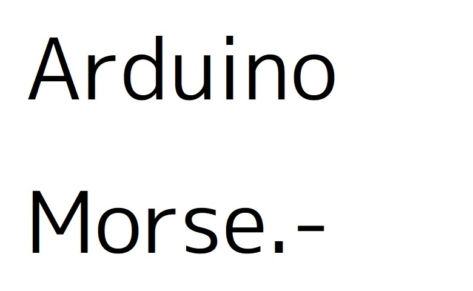

# ArduinoMorse


## Overview
Morse output with Arduino

## Features
- supports serial communication
- supports Wabun

## Function
- `void morse_init(pin,frequency,delay);`
	- initializing variables
- `void morse_string(string);`
	- output morse from string
- `void m(char*);`
	- output morse from char\*

## Example
```c++
  /*==========================*/
 /*<Copyright (c) 2022 x256x>*/
/*==========================*/
#include "libmorse.h"

String str;

void setup(){
  //morse_init(pin,frequency,delay);
  morse_init(13,1000,50);
  Serial.begin(9600);
}

void loop(){
  if (Serial.available() > 0){
    str=Serial.readString();
    morse_string(str);
  }
}
```

## Licence
[MIT licence](LICENSE)

---
### To do
ArduinoUno以外での動作確認  
和文と英文以外の文字(キリル文字など)への対応  
グローバルのライブラリ化  
Etc...